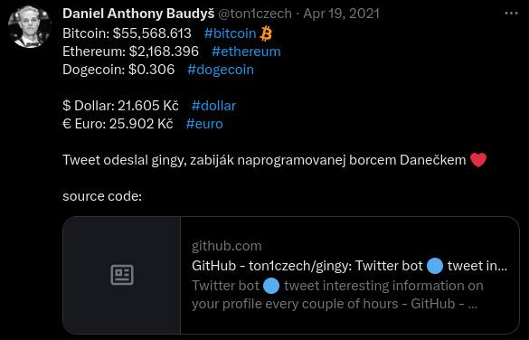
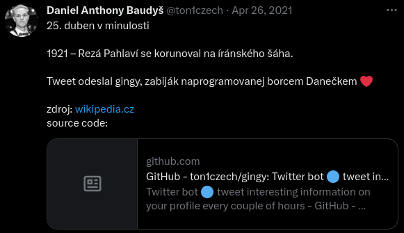
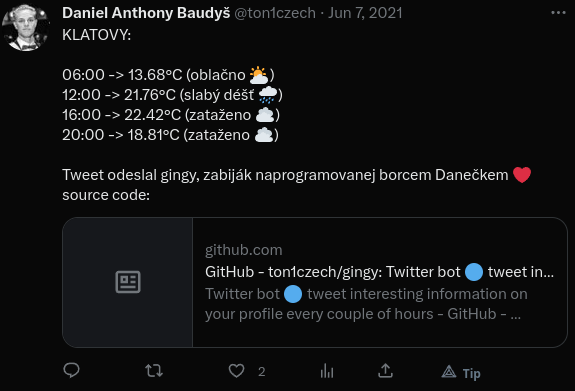

<div align='center'>
    <h1><b>🚀 GINGY 🚀</b></h1>
    
    <p>Informative Twitter BOT</p>
</div>


</br>

---

## 💾 **ABOUT**

Python bot to make your Twitter account more active and informative.
</br>
What gingy tweets:

- Cryptocurrency and currency prices
- History event
- Latest YouTube video
- Weather forecast
- Game sales
- COVID-19 Cases, Recovered and Deaths
- Namedays

</br>

---

## 🗒️ **INSTALLATION**

```bash
# Step 1: Clone the repository
git clone https://github.com/ton1czech/gingy

# Step 2: CD into cloned repository
cd gingy/

# Step 3: Install dependancies
pip install -r requirements.txt

# Step 4: Setup Twitter developer account
- https://developer.twitter.com/en

# Step 5: Setup Heroku account
- https://heroku.com/

# Step 6: Setup OpenWeatherMap account (if you want to tweet weather forecast)
- https://openweathermap.org/

# Step 7: Make .env file inside root directory and fill out credentials (like in .env.example)
consumer_key="abc123"
consumer_secret="abc123"
access_token="abc123"
access_token_secret="abc123"
openweathermap_key="abc123"

# Step 8: Change YouTube URL to your's channel URL in 'src/youtube/main.py'

# Step 9: Host the application on Heroku

# Step 10: Add heroku config variables (exactly same as in .env.example) and dont forget to specify your timezone (TZ=Continent/City)
consumer_key - abc123
consumer_secret - abc123
access_token - abc123
access_token_secret - abc123
openweathermap_key - abc123
TZ - Europe/Prague
```

</br>

---

## 🔎 **SHOWCASE**





</br>

---

## 💻 **TECHNOLOGIES**


</br>

---

## 📎 **LICENSE**

MIT License

Copyright © 2021-2023 Daniel Anthony Baudyš (ton1czech)

Permission is hereby granted, free of charge, to any person obtaining a copy of this software and associated documentation files (the "Software"), to deal in the Software without restriction, including without limitation the rights to use, copy, modify, merge, publish, distribute, sublicense, and/or sell copies of the Software, and to permit persons to whom the Software is furnished to do so, subject to the following conditions:

The above copyright notice and this permission notice shall be included in all copies or substantial portions of the Software.

THE SOFTWARE IS PROVIDED "AS IS", WITHOUT WARRANTY OF ANY KIND, EXPRESS OR IMPLIED, INCLUDING BUT NOT LIMITED TO THE WARRANTIES OF MERCHANTABILITY, FITNESS FOR A PARTICULAR PURPOSE AND NONINFRINGEMENT. IN NO EVENT SHALL THE AUTHORS OR COPYRIGHT HOLDERS BE LIABLE FOR ANY CLAIM, DAMAGES OR OTHER LIABILITY, WHETHER IN AN ACTION OF CONTRACT, TORT OR OTHERWISE, ARISING FROM, OUT OF OR IN CONNECTION WITH THE SOFTWARE OR THE USE OR OTHER DEALINGS IN THE SOFTWARE.

</br>

---

## 📌 **CREDITS**

##### Daniel Anthony Baudyš (ton1czech)

programmer, investor and god 🤫


[](https://github.com/ton1czech)
[](https://twitter.com/ton1czech)
[](https://instagram.com/ton1czech)
[](https://www.youtube.com/channel/UCblA_CnykG2Dw_6IMwZ9z9A)

[](https://reddit.com/user/)
[](https://www.tiktok.com/@ton1czech)
[](https://gitlab.com/ton1czech)
[](https://dribbble.com/ton1czech)

[](https://stackoverflow.com/users/15073347/ton1czech)
[]()
[](https://steamcommunity.com/id/ton1czech)
[](https://open.spotify.com/user/212btc3myry7hwb45aybf4efi)
